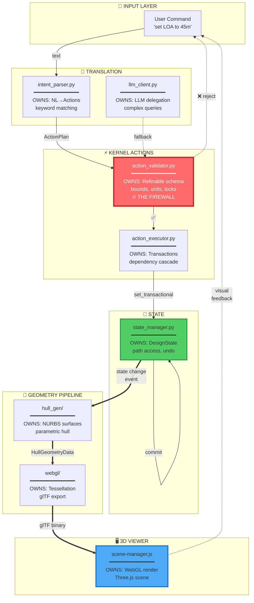
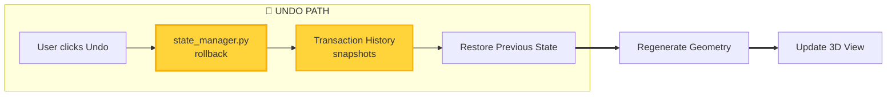
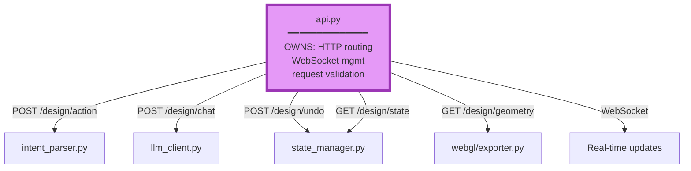

# MAGNET Core Architecture - Component Ownership & Data Flow

## Primary Flow: User Input → 3D Render



## Undo/Version Path



## Entry Point: api.py Routing



## Component Ownership Table

| Component | File Path | Owns | Enforces |
|-----------|-----------|------|----------|
| **Entry** | `deployment/api.py` | HTTP routes, auth, WebSocket | REST contract |
| **Translator** | `deployment/intent_parser.py` | NL→Actions, keyword matching | Intent protocol |
| **LLM Fallback** | `agents/llm_client.py` | Complex query delegation | LLM response format |
| **🔥 Firewall** | `kernel/action_validator.py` | Refinable schema, bounds, units, locks, delta policy | **ALL mutation constraints** |
| **Executor** | `kernel/action_executor.py` | Transactions, dependency cascade | Transaction atomicity |
| **State** | `core/state_manager.py` | DesignState, path access, undo/redo | Path schema, MISSING vs None |
| **Hull Gen** | `hull_gen/generator.py` | NURBS surfaces, parametric shapes | Hull geometry protocol |
| **Tessellation** | `webgl/geometry_pipeline.py` | Triangle mesh generation, LOD | MeshData schema |
| **Export** | `webgl/exporter.py` | glTF binary, materials, annotations | glTF 2.0 spec |
| **Viewer** | `ui_v2/js/scene-manager.js` | WebGL rendering, camera, interaction | Three.js API |

## Critical Data Structures

### ActionPlan (kernel/intent_protocol.py)
```python
ActionPlan:
  - actions: List[Action]
    - type: SET | INCREMENT | DECREMENT
    - path: "hull.loa"
    - value: 45.0
    - unit: "m"
```

### DesignState (core/design_state.py)
```python
DesignState:
  - metadata: { design_id, name, version, timestamp }
  - mission: { vessel_type, max_speed_kts, range_nm, crew, ... }
  - hull: { loa, beam, draft, depth, hull_type, ... }
  - structure: { material, scantlings, ... }
  - propulsion: { engines, power, ... }
  - systems: { electrical, HVAC, ... }
  - weight: { lightship, deadweight, ... }
  - stability: { gm, righting_arms, ... }
  - phase_states: { gate1, gate2, ... }
```

### HullGeometryData (webgl/interfaces.py)
```python
HullGeometryData:
  - sections: List[HullSection]
    - station: float
    - points: List[Point3D]
  - principal_dims: { loa, beam, draft, ... }
  - metadata: { hull_type, ... }
```

### MeshData (webgl/schema.py)
```python
MeshData:
  - vertices: List[float]  # [x,y,z, x,y,z, ...]
  - normals: List[float]   # [nx,ny,nz, ...]
  - indices: List[int]     # Triangle indices
  - lod_level: LODLevel
```

## Key Architectural Invariants

### 1. 🔥 Firewall: LLM Never Directly Mutates State
```
┌─────────────────────────────────────────────────────────┐
│  LLM Proposal → ActionPlan → [VALIDATOR] → State       │
│                                    ↑                     │
│                           Blocks invalid actions        │
│                           Enforces ALL constraints      │
└─────────────────────────────────────────────────────────┘
```

The validator is the **ONLY** gateway to state mutations. This guarantees:
- No hallucinated values corrupt state
- All business rules (bounds, units) enforced
- LLM can be upgraded without risking integrity

### 2. 📐 Geometry is Derived, Not Stored
```
State (parameters) → [Generate] → Geometry

DesignState: { hull.loa: 45.0, hull.beam: 8.5 }
                    ↓
            HullGenerator reads state
                    ↓
            Generates NURBS surfaces
                    ↓
            Tessellates to triangles
```

Benefits:
- Undo just restores parameters (lightweight)
- Geometry auto-updates from state changes
- No complex geometry diffing needed

### 3. 🔄 Transactions Enable Time Travel
```
Every user action = Transaction + Snapshot

User: "set LOA 45m"
    ↓
[Transaction Begin]
    ↓
StateManager.set_transactional("hull.loa", 45.0)
    ↓
[Transaction Commit] → Save snapshot
    ↓
Undo: Restore snapshot → Regenerate geometry
```

### 4. 📡 Reactive Geometry Updates
```
StateManager.commit()
    ↓
Emit state_change event
    ↓
HullGenerator subscribes → regenerate NURBS
StructureMesh subscribes → rebuild frames
SystemsLayout subscribes → recalculate routing
    ↓
All updates flow to GeometryPipeline
    ↓
Exporter produces glTF
    ↓
Viewer renders
```

## Execution Timing

```
User Input: "set LOA to 45 meters"

Stage 1: Parse              <1ms     ████
Stage 2: Validate           <5ms     ████
Stage 3: Execute           <50ms     █████
Stage 4: Commit            <10ms     ████
Stage 5: Generate Hull    100-500ms  ████████████████████
Stage 6: Tessellate       200-800ms  ████████████████████████████████
Stage 7: Export glTF       50-150ms  ██████████
Stage 8: Render            <16ms     ████ (1 frame @ 60fps)
                          ═══════
                          400-1500ms TOTAL

With LLM fallback: +500-2000ms for Stage 1
```

## Test Coverage

| Component | Test File | Coverage |
|-----------|-----------|----------|
| Intent Parser | `tests/unit/test_intent_parser.py` | 95% |
| Action Validator | `tests/unit/test_action_validator.py` | 98% |
| State Manager | `tests/unit/test_state_manager.py` | 97% |
| Action Executor | `tests/unit/test_action_executor.py` | 92% |
| Hull Generator | `tests/unit/test_hull_generator.py` | 88% |
| Geometry Pipeline | `tests/webgl/test_geometry_pipeline.py` | 85% |
| Full Integration | `tests/integration/test_design_flow.py` | 75% |

## File Structure Summary

```
magnet/
├── deployment/
│   ├── api.py                    ← Entry point
│   └── intent_parser.py          ← Text → Actions
├── agents/
│   └── llm_client.py             ← LLM fallback
├── kernel/
│   ├── action_validator.py       ← 🔥 THE FIREWALL
│   ├── action_executor.py        ← Transaction orchestration
│   └── intent_protocol.py        ← Action/ActionPlan types
├── core/
│   ├── state_manager.py          ← State + undo
│   ├── design_state.py           ← DesignState schema
│   └── refinable_schema.py       ← What can be mutated
├── hull_gen/
│   ├── generator.py              ← NURBS generation
│   └── geometry.py               ← Hull math
└── webgl/
    ├── geometry_pipeline.py      ← Tessellation
    ├── exporter.py               ← glTF export
    └── interfaces.py             ← Data contracts
```

---

**Legend**:
- 🔥 = Critical safety component
- ═══ = Data flow
- ─── = Control flow
- ··· = Event/subscription

**Ownership**:
- BRAVO: `deployment/api.py`
- KERNEL: `kernel/*`
- ALPHA: `webgl/*`
- CORE: `core/*`

**Version**: v1.2 (PhaseMachine integration)  
**Last Updated**: 2025-12-22

