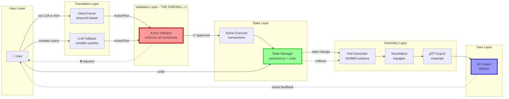

# MAGNET Architecture - Simplified View

<!-- AGENT_CONTEXT
Purpose: [TODO: Add purpose description]
Authoritative: No
Keywords: [architecture, simple]
Depends_On: None
Used_By: [TODO: Add users]
Status: current
Last_Verified: 2026-01-15
-->


## Core Data Flow



## Key Components

### 1. **api.py** - Entry Point
- Receives HTTP requests
- Routes to intent parser or LLM
- Returns results to user

### 2. **intent_parser.py** - Text → Actions
- Keyword-based parsing (fast, <1ms)
- Fallback to LLM for complex queries

### 3. **action_validator.py** - The Firewall 🔥
- **CRITICAL**: Only gateway to state mutations
- Enforces REFINABLE_SCHEMA whitelist
- Validates units, bounds, locks
- **Blocks all invalid actions**

### 4. **state_manager.py** - State + Undo
- Path-based state access: `get("hull.loa")`
- Transaction support: begin → set → commit
- Undo/redo via snapshots
- Persists to JSON

### 5. **hull_gen/** - Geometry Generation
- NURBS surface generation
- Parametric hull shapes
- Reacts to state changes

### 6. **webgl/** - 3D Pipeline
- **geometry_pipeline.py**: Tessellation to triangles
- **exporter.py**: glTF export
- **Materials, annotations, LOD**

## Data Flow Example: "Set LOA to 45 meters"

```
┌──────────────────────────────────────────────────────────────┐
│ 1. User Input: "set LOA to 45 meters"                       │
└────────────────────────┬─────────────────────────────────────┘
                         │
                         ▼
┌──────────────────────────────────────────────────────────────┐
│ 2. Intent Parser                                             │
│    Regex match: "set {param} to {value} {unit}"            │
│    Output: Action(SET, "hull.loa", 45.0, "m")              │
└────────────────────────┬─────────────────────────────────────┘
                         │
                         ▼
┌──────────────────────────────────────────────────────────────┐
│ 3. Action Validator (FIREWALL)                              │
│    ✓ "hull.loa" in REFINABLE_SCHEMA                         │
│    ✓ Convert 45.0m to canonical unit                        │
│    ✓ Clamp to bounds [10, 200]                              │
│    ✓ Not locked by user                                     │
│    → APPROVED                                                │
└────────────────────────┬─────────────────────────────────────┘
                         │
                         ▼
┌──────────────────────────────────────────────────────────────┐
│ 4. Action Executor                                           │
│    - Begin transaction                                       │
│    - StateManager.set_transactional("hull.loa", 45.0)      │
│    - Trigger dependency cascade (beam, draft)               │
│    - Commit transaction                                      │
└────────────────────────┬─────────────────────────────────────┘
                         │
                         ▼
┌──────────────────────────────────────────────────────────────┐
│ 5. State Manager                                             │
│    - Update DesignState                                      │
│    - Save snapshot for undo                                  │
│    - Emit state change event                                 │
│    - Persist to design_state.json                           │
└────────────────────────┬─────────────────────────────────────┘
                         │
                         ▼
┌──────────────────────────────────────────────────────────────┐
│ 6. Hull Generator                                            │
│    - Receive state change event                              │
│    - Read new hull.loa=45.0                                  │
│    - Regenerate NURBS surfaces                               │
│    - Output HullGeometryData                                 │
└────────────────────────┬─────────────────────────────────────┘
                         │
                         ▼
┌──────────────────────────────────────────────────────────────┐
│ 7. Geometry Pipeline                                         │
│    - Tessellate NURBS to triangles                          │
│    - Generate LOD levels                                     │
│    - Output MeshData                                         │
└────────────────────────┬─────────────────────────────────────┘
                         │
                         ▼
┌──────────────────────────────────────────────────────────────┐
│ 8. Exporter                                                  │
│    - Build glTF structure                                    │
│    - Assign materials                                        │
│    - Embed annotations                                       │
│    - Output glTF binary                                      │
└────────────────────────┬─────────────────────────────────────┘
                         │
                         ▼
┌──────────────────────────────────────────────────────────────┐
│ 9. 3D Viewer                                                 │
│    - Load glTF                                               │
│    - Render with Three.js                                    │
│    - Display updated hull to user                            │
└──────────────────────────────────────────────────────────────┘

Total time: 400-1500ms
```

## Undo Flow

```
User clicks "Undo"
    ↓
StateManager.rollback()
    ↓
Restore previous snapshot
    ↓
Emit state change event
    ↓
Hull Generator regenerates from old state
    ↓
Geometry Pipeline re-tessellates
    ↓
Viewer updates to show previous design
```

## Critical Invariants

### 🔒 Firewall Guarantee
```
NOTHING bypasses action_validator.py
    - Not LLM
    - Not direct API calls
    - Not keyboard shortcuts
    - NOTHING

The validator is the ONLY path to state mutation.
```

### 📐 Geometry is Derived, Not Stored
```
State (parameters) → Generate → Geometry

State contains: { hull.loa: 45.0, hull.beam: 8.5, ... }
Geometry: COMPUTED on demand from state
    - Undo just restores parameters
    - Geometry auto-regenerates
```

### 🔄 Every Action is a Transaction
```
User Action → Transaction → Snapshot → Undo Stack

Each user action creates:
    1. Transaction (atomic commit)
    2. Snapshot (for undo)
    3. Audit log entry
```

## File Map

| What | File |
|------|------|
| REST API entry | `magnet/deployment/api.py` |
| Intent → Actions | `magnet/deployment/intent_parser.py` |
| LLM fallback | `magnet/agents/llm_client.py` |
| **THE FIREWALL** | `magnet/kernel/action_validator.py` |
| Execute actions | `magnet/kernel/action_executor.py` |
| State + undo | `magnet/core/state_manager.py` |
| Hull geometry | `magnet/hull_gen/generator.py` |
| Tessellation | `magnet/webgl/geometry_pipeline.py` |
| glTF export | `magnet/webgl/exporter.py` |
| 3D viewer | `magnet/ui_v2/js/scene-manager.js` |

## Performance

| Stage | Time |
|-------|------|
| Parse intent (keyword) | <1ms |
| Parse intent (LLM) | 500-2000ms |
| Validate | <5ms |
| Execute | 10-200ms |
| Generate hull | 100-500ms |
| Tessellate | 200-800ms |
| Export glTF | 50-150ms |
| **Total (no LLM)** | **400-1500ms** |
| **Total (with LLM)** | **1-3.5 seconds** |

---

**TL;DR**: User → Parser → **VALIDATOR (firewall)** → State → Geometry → 3D View

