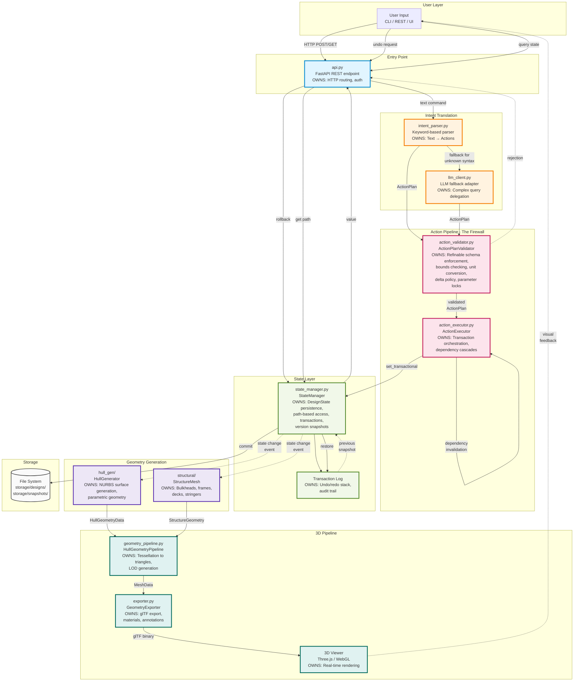
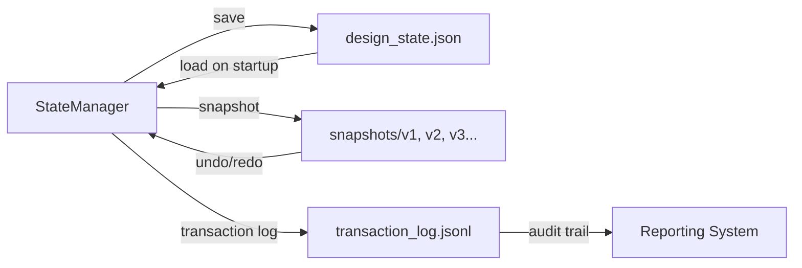

# MAGNET System Architecture

<!-- AGENT_CONTEXT
Purpose: [TODO: Add purpose description]
Authoritative: No
Keywords: [system, architecture]
Depends_On: None
Used_By: [TODO: Add users]
Status: current
Last_Verified: 2026-01-15
-->


## Complete Data Flow Diagram



## Component Ownership Map

| Component | File | Responsibilities | Contracts Enforced |
|-----------|------|------------------|-------------------|
| **API Entry** | `deployment/api.py` | HTTP routing, request validation, WebSocket management | REST API contract |
| **Intent Parser** | `deployment/intent_parser.py` | Keyword-based NL → Actions, REFINABLE_SCHEMA keywords only | Intent Protocol |
| **LLM Translator** | `agents/llm_client.py` | Fallback for complex queries, delegates to `magnet.llm` | LLM Response Protocol |
| **Validator (Firewall)** | `kernel/action_validator.py` | Refinable schema enforcement, unit conversion, bounds clamping, delta policy, lock checking | REFINABLE_SCHEMA, Parameter Bounds |
| **Action Executor** | `kernel/action_executor.py` | Transaction orchestration, dependency cascade triggering | Transaction Protocol |
| **State Manager** | `core/state_manager.py` | Path-based state access, DesignState persistence, transactions, versioning | StateManagerContract |
| **Transaction Log** | Built into StateManager | Undo/redo stack, audit trail, snapshot management | Version Protocol |
| **Hull Generator** | `hull_gen/generator.py` | NURBS surface generation from parameters, parametric hull geometry | Hull Geometry Protocol |
| **Structure Mesh** | `structural/structure_mesh.py` | Bulkhead, frame, deck, stringer generation | Structure Geometry Protocol |
| **Geometry Pipeline** | `webgl/geometry_pipeline.py` | Hull tessellation to triangles, LOD generation, mesh optimization | MeshData Schema |
| **Geometry Exporter** | `webgl/exporter.py` | glTF export, material assignment, annotation embedding | glTF 2.0 Spec |
| **3D Viewer** | `magnet/ui_v2/js/` | Real-time WebGL rendering, user interaction | Three.js API |

## Critical Invariants

### 1. **LLM Never Directly Mutates State**
```
User Input → Intent Translation → ActionPlan → Validator (Firewall) → Executor → StateManager
                                         ↑
                                  BLOCKS invalid actions
                                  NEVER lets bad data through
```

The `action_validator.py` is the **only gateway** to state mutations. It enforces:
- REFINABLE_SCHEMA path whitelist
- Unit conversion and normalization
- Bounds clamping (min/max)
- Parameter locks (if user locked a value)
- Delta policy for relative changes ("increase by a bit")

### 2. **State Changes Trigger Geometry Pipeline**
```
StateManager.commit() → Event → HullGenerator → GeometryPipeline → Exporter → Viewer
```

When state commits, dependent geometry systems react:
- **hull_gen** regenerates NURBS surfaces if hull params changed
- **structural** rebuilds frames/bulkheads if structure params changed
- **webgl/geometry_pipeline** tessellates to triangles
- **webgl/exporter** produces glTF binary
- Viewer receives update via WebSocket or HTTP poll

### 3. **Transactions Enable Undo/Redo**
```
User Action → StateManager.begin_transaction()
           → Multiple set_transactional() calls
           → StateManager.commit()
           → Snapshot saved to transaction log

User Undo → StateManager.rollback()
         → Restore previous snapshot
         → Re-trigger geometry pipeline
```

Every user action creates a transaction with a snapshot. The undo system replays snapshots backward.

## Data Flow Examples

### Example 1: User Sets LOA
```
1. User: "set LOA to 45 meters"
2. api.py receives POST /design/{id}/action
3. intent_parser.py: "set LOA to 45 meters" → Action(SET, "hull.loa", 45.0, "m")
4. action_validator.py:
   - Check "hull.loa" is in REFINABLE_SCHEMA ✓
   - Convert 45.0 m → 45.0 m (canonical unit)
   - Clamp to bounds [10, 200] ✓
   - Check not locked ✓
   - Approve action
5. action_executor.py:
   - Begin transaction
   - StateManager.set_transactional("hull.loa", 45.0)
   - Trigger dependency cascade (beam, draft may auto-adjust)
   - Commit transaction
6. StateManager emits state change event
7. hull_gen.generator.py receives event, regenerates hull NURBS
8. webgl.geometry_pipeline.py tessellates to triangles
9. webgl.exporter.py exports glTF
10. Viewer receives update, renders new hull
```

### Example 2: Complex Query Requires LLM
```
1. User: "I need a fast patrol boat for 200nm range in rough seas"
2. api.py receives POST /design/{id}/chat
3. intent_parser.py: No keyword match → fallback to LLM
4. llm_client.py:
   - Prompt: "Translate to ActionPlan: 'fast patrol boat...'"
   - LLM response: [
       Action(SET, "mission.vessel_type", "patrol"),
       Action(SET, "mission.range_nm", 200),
       Action(SET, "mission.max_speed_kts", 35),
       Action(SET, "mission.design_sea_state", 5)
     ]
5. Continue from step 4 in Example 1 (validator → executor → state)
```

### Example 3: Undo Last Change
```
1. User clicks "Undo" or types "/undo"
2. api.py receives POST /design/{id}/undo
3. StateManager.rollback():
   - Pop last transaction from history
   - Restore previous snapshot
   - Emit state change event
4. Geometry pipeline re-runs from restored state
5. Viewer updates to show previous design
```

## Version Control & Persistence



- **design_state.json**: Current authoritative state
- **snapshots/**: Timestamped versions for undo/redo
- **transaction_log.jsonl**: Append-only audit trail of all changes

## Key Architectural Decisions

### 1. **Validator as Firewall**
The validator sits between **any** input (LLM, keyword parser, direct API) and the state. This ensures:
- No malicious or buggy input can corrupt state
- All business rules (bounds, units, locks) enforced in one place
- LLM can be swapped/upgraded without risking state integrity

### 2. **Path-Based State Access**
```python
state.get("hull.loa")  # Simple, auditable
state.set("hull.loa", 45.0)  # Transaction-aware
```
- No object graph navigation (`state.hull.loa`)
- Paths are strings, easy to log/serialize/validate
- Enables fine-grained dependency tracking

### 3. **Reactive Geometry Pipeline**
Geometry is **derived** from state, never stored in state:
- State change → Event → Geometry regenerates
- Keeps state minimal (just parameters)
- Enables undo/redo without complex diffing

### 4. **Transaction-Based Mutations**
Every user action is a transaction:
- Atomic: All-or-nothing commits
- Reversible: Snapshots enable undo
- Auditable: Transaction log captures history

## Performance Characteristics

| Operation | Latency | Notes |
|-----------|---------|-------|
| Parse intent (keyword) | <1ms | Regex-based, no LLM |
| Parse intent (LLM fallback) | 500-2000ms | Network + inference |
| Validate ActionPlan | <5ms | Schema check + math |
| Execute actions (simple) | <10ms | State mutation |
| Execute actions (cascade) | 50-200ms | Dependency propagation |
| Generate hull geometry | 100-500ms | NURBS computation |
| Tessellate to mesh (high LOD) | 200-800ms | Triangle generation |
| Export glTF | 50-150ms | Serialization |
| **Total (keyword → 3D)** | **400-1500ms** | Without LLM |
| **Total (LLM → 3D)** | **1000-3500ms** | With LLM fallback |

## Technology Stack

- **Backend**: Python 3.11+, FastAPI, Pydantic
- **State**: Custom DesignState (Pydantic dataclass), JSON persistence
- **Geometry**: NURBS (scipy, geomdl), numpy, custom tessellation
- **Export**: glTF 2.0 (pygltflib)
- **Frontend**: Three.js, WebGL 2.0, vanilla JS
- **LLM**: Anthropic Claude (via magnet.llm), OpenAI-compatible API

## Testing Strategy

| Layer | Test Type | Tool | Coverage |
|-------|-----------|------|----------|
| Intent Parser | Unit | pytest | 95%+ |
| Validator | Unit | pytest | 98%+ |
| State Manager | Unit | pytest | 97%+ |
| Action Executor | Integration | pytest | 90%+ |
| Geometry Pipeline | Integration | pytest | 85%+ |
| Full Stack | E2E | pytest + requests | 70%+ |

Key test: `tests/unit/test_action_executor.py` validates full pipeline.

## Future Enhancements

1. **Parallel Geometry Generation**: Async/multiprocess hull + structure + systems
2. **Incremental Tessellation**: Only re-tessellate changed regions
3. **Client-Side Prediction**: Optimistic UI updates before server confirms
4. **Distributed State**: Multi-user collaboration with CRDT
5. **GPU Tessellation**: WebGPU compute shaders for mesh generation

---

**Diagram Generated**: 2025-12-22  
**Architecture Version**: v1.2 (PhaseMachine integration)  
**Maintained by**: BRAVO (api.py), ALPHA (webgl), KERNEL (action_validator)

