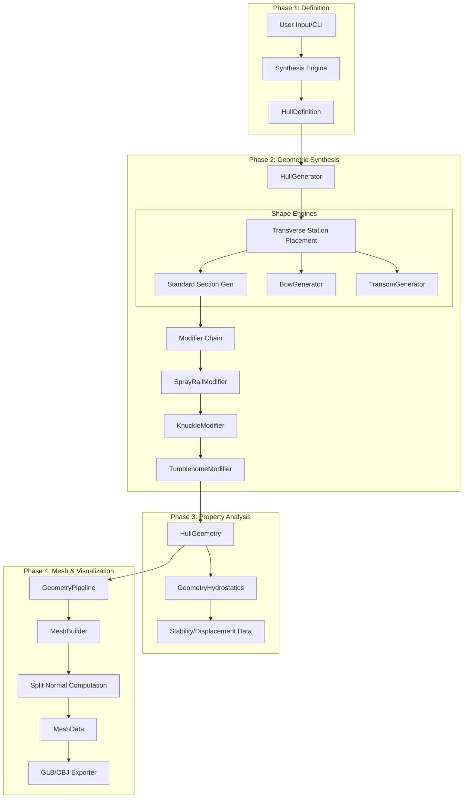

# MAGNET Hull Generation System: Technical Deep Dive

This document provides a comprehensive technical reference for the MAGNET Hull Generation System, covering the complete pipeline from parametric input to 3D mesh output and hydrostatic analysis.

---

## Table of Contents
1. [Architecture Overview](#1-architecture-overview)
2. [Data Flow Pipeline](#2-data-flow-pipeline)
3. [Input Data Structures (`parameters.py`)](#3-input-data-structures)
4. [Geometry Primitives (`geometry.py`)](#4-geometry-primitives)
5. [The Core Generation Algorithm (`generator.py`)](#5-the-core-generation-algorithm)
6. [Mathematical Formulas](#6-mathematical-formulas)
7. [Feature Engines](#7-feature-engines)
    - [7.1 Bow Generator](#71-bow-generator)
    - [7.2 Transom Generator](#72-transom-generator)
    - [7.3 Section Modifiers](#73-section-modifiers)
    - [7.4 Deck Generator](#74-deck-generator)
8. [Mesh Building Pipeline (`webgl/`)](#8-mesh-building-pipeline)
9. [Hydrostatics Integration (`physics/`)](#9-hydrostatics-integration)
10. [Code Examples](#10-code-examples)

---

## 1. Architecture Overview

The MAGNET Hull Generation System is designed as a modular, decoupled pipeline. It separates the **Engineering Definition** (what the hull is) from the **Geometric Synthesis** (how it's shaped) and the **Visual Representation** (how it looks in 3D).

### Key Components:
- **`HullGenerator`**: The central orchestrator that manages station placement and dispatches shape generation to specialized sub-systems.
- **`BowGenerator` / `TransomGenerator`**: Modular engines for complex hull extremities.
- **Modifier System**: A chain of "filters" that apply local features like spray rails or tumblehome to generated sections.
- **`GeometryPipeline`**: Converts longitudinal sections into a triangulated manifold mesh.
- **`MeshBuilder`**: A low-level utility that handles topological consistency and "Split Normal" computation for hard edges.

---

## 2. Data Flow Pipeline



---

## 3. Input Data Structures

Located in `magnet/hull_gen/parameters.py`.

### `HullDefinition`
The root container for a hull instance.
- `hull_id`: Unique string identifier.
- `dimensions`: Instance of `MainDimensions`.
- `coefficients`: Instance of `FormCoefficients`.
- `deadrise`: Instance of `DeadriseProfile`.
- `features`: Instance of `HullFeatures`.

### `MainDimensions`
Linear parameters in meters.
- `loa`: Length Overall.
- `lwl`: Length on Waterline.
- `beam_max`: Maximum Beam.
- `draft`: Design Draft.
- `depth`: Moulded Depth.

### `FormCoefficients`
Non-dimensional fullness controls.
- `cb`: Block Coefficient (Primary fullness).
- `cp`: Prismatic Coefficient (Longitudinal volume distribution).
- `cm`: Midship Coefficient (Sectional fullness).
- `lcb`: Longitudinal Center of Buoyancy (as % of LWL from AP).

---

## 4. Geometry Primitives

Located in `magnet/hull_gen/geometry.py`.

### `SectionPoint`
The atomic unit of hull geometry.
```python
@dataclass
class SectionPoint:
    position: Point3D
    normal: Optional[Point3D] = None
    edge_type: EdgeType = EdgeType.SMOOTH  # SMOOTH, HARD, or CREASE
    feature_id: Optional[str] = None       # e.g., "spray_rail_1"
    is_chine: bool = False
    is_keel: bool = False
```

### `HullSection`
A collection of points at a fixed `x_position`.
- `station`: 0.0 (Stern) to 1.0 (Bow).
- `points`: Ordered list of `SectionPoint` from Keel to Deck Edge.
- `area`: Cross-sectional area below waterline (computed).

---

## 5. The Core Generation Algorithm

### 5.1 Station Distribution
`HullGenerator` divides the `lwl` into $N$ sections (default 21). 
- **Station 0.0**: Aft Perpendicular (AP).
- **Station 1.0**: Forward Perpendicular (FP).

### 5.2 Section Dispatch
The generator determines which algorithm to use for each section based on `ChineType` and `HullType`:
- `_generate_round_section`: Elliptical approximation for displacement hulls.
- `_generate_chine_section`: V-bottom with distinct chine point.
- `_generate_multi_chine_section`: Supports Double/Triple chines.
- `_generate_variable_chine_section`: Smoothly transitions from round (Bow) to hard chine (Stern).

---

## 6. Mathematical Formulas

### 6.1 Section Fullness ($\phi$)
Fullness is a normalized factor (0 to 1) derived from $C_b$ and $C_m$.
\[ \phi = 0.7 \times \frac{C_b - 0.35}{0.25} + 0.3 \times \frac{C_m - 0.70}{0.20} \]
*Note: Coefficients are clamped to sensitive operating bands.*

### 6.2 Bottom Shaping (Power Curve)
Used in `_generate_chine_section` to create curvature between keel and chine.
\[ Z = (1 - \phi) \times Z_{linear} + \phi \times Z_{flat} \]
Where:
- $Z_{linear}$ is a direct V-shape.
- $Z_{flat}$ is a cubic transition: $Z = -T + (t^{\text{exp}}) \times (Z_{chine} + T)$.
- $\text{exp} = 1.4 + 6.0 \times \phi$.

### 6.3 Beam Distribution Factor ($\beta$)
Modulates the local half-beam at station $s$.
- **Transom ($s < 0.1$):** Linear interpolation from `transom_width_fraction` to 1.0.
- **Midbody ($0.1 < s < LCB$):** $\beta = 1.0$ (Parallel middle body).
- **Bow Entrance ($s > 0.9$):** $\beta = 0.9 - (0.9 - \text{bow\_end}) \times t^{1.5}$.

---

## 7. Feature Engines

### 7.1 Bow Generator
Handles non-traditional forward shapes.
- **Axe Bow**: Uses a square-root beam growth ($\sqrt{t}$) to maintain extreme sharpness at the entry.
- **Faceted Bow**: Generates planar panels. Each panel boundary is marked `EdgeType.HARD`.

### 7.2 Transom Generator
Supports complex stern closures.
- **Segmented Transoms**: Allows multiple rake angles (e.g., a vertical step for outboard engines).
- **Curvature**: Applies athwartships parabolic bulge: $y_{\text{adj}} = c \times (1 - t^2)$.

### 7.3 Section Modifiers
Applied in `HullGenerator._generate_section_at_station` after base geometry is created.
```python
# magnet/hull_gen/generator.py
for modifier in self._section_modifiers:
    points = modifier.modify(points, station, definition)
```
- **Spray Rails**: Projects geometry outward at a specified angle. Uses a Quadratic Bezier for 3-point longitudinal tapering.
- **Tumblehome**: Reduces $Y$ above the waterline: $y_{\text{new}} = y_{\text{old}} - (z - z_{\text{start}}) \times \tan(\theta)$.

---

## 8. Mesh Building Pipeline

### 8.1 Split Normal Algorithm
Located in `magnet/webgl/mesh_builder.py`. This is the most critical logic for technical rendering.

1. **Adjacency Check**: For every vertex, find all adjacent triangle faces.
2. **Hard Edge Detection**: If a vertex is marked `EdgeType.HARD` OR if an edge between two faces is in the `_hard_edges` set.
3. **Grouping**: Group adjacent faces that are NOT separated by a hard edge.
4. **Vertex Splitting**: If a vertex has $M$ groups, duplicate the vertex $M$ times. Each duplicate gets the averaged normal of only its group's faces.

---

## 9. Hydrostatics Integration

Located in `magnet/physics/geometry_hydrostatics.py`.

### 9.1 Numerical Integration
Uses Simpson's 1/3 Rule for volume and moments.
\[ \text{Volume} = \frac{\Delta x}{3} \left( A_0 + 4A_1 + 2A_2 + 4A_3 + \dots + A_n \right) \]

### 9.2 Properties Computed:
- **Displacement**: Total submerged volume $\times$ density.
- **LCB**: Longitudinal center of buoyancy (first moment of area curve).
- **KB**: Height of buoyancy center above keel.
- **Wetted Surface**: Integration of submerged girth ($G$) along length: $S = \int G(x) dx$.

---

## 10. Code Examples

### 10.1 Generating a Hull Mesh
```python
from magnet.hull_gen.generator import HullGenerator
from magnet.hull_gen.parameters import HullDefinition
from magnet.webgl.geometry_pipeline import HullGeometryPipeline

# 1. Setup Definition
definition = HullDefinition.from_dict(params)

# 2. Synthesize Geometry
generator = HullGenerator()
geometry = generator.generate(definition)

# 3. Tessellate to Mesh
pipeline = HullGeometryPipeline(hull_geom=geometry)
mesh_data = pipeline.tessellate()

# 4. Export
from magnet.webgl.exporter import GeometryExporter, ExportFormat
exporter = GeometryExporter()
result = exporter.export(mesh_data, ExportFormat.GLB)
```

### 10.2 Variable Chine Transition
```python:849:859:magnet/hull_gen/generator.py
        if station < transition_start:
            # Pure soft chine forward
            hardness = 0.0
        elif station > transition_end:
            # Pure hard chine aft
            hardness = 1.0
        else:
            # Transition zone - smooth interpolation
            t = (station - transition_start) / max(0.01, transition_end - transition_start)
            hardness = self._smooth_step(t)
```

---
*End of Documentation*

